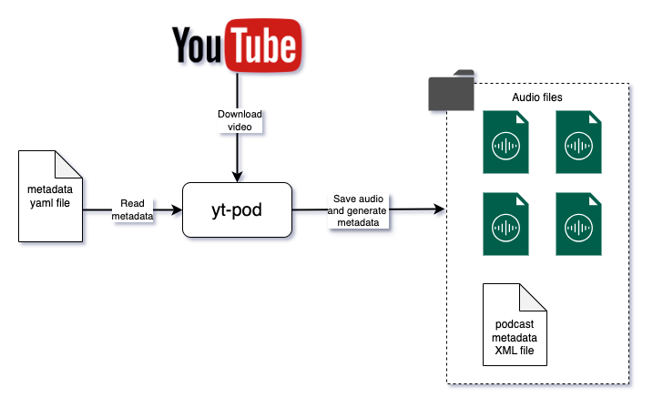

# yt-pod

This lightweight application allows you to convert YouTube videos into Apple Podcasts. It downloads and extracts the audio from videos, generates an XML metadata file, and stores everything locally or in the cloud (e.g., AWS S3).



# Features

- convert YouTube videos to audio format
- generate an Apple Podcasts-compatible XML metadata file
- files ready to store locally or on a cloud service
- ready to add the podcast to Apple Podcasts app via URL or publish to Apple


## Usage

Before running the application, update the `podcast.yml` file with the necessary podcast metadata, including the list of YouTube videos to process.

### Run locally as python application

Ensure you have Python 3 installed, then follow these steps:

```sh
python3 -m venv venv
source venv/bin/activate
pip install -r requirements.txt
python main.py
```

### Run using docker

You can also run the application using Docker

```sh
docker pull
docker run -v volume:volume
```

## Add to Your Podcast App

Once the files are processed, you can add your podcast to Apple Podcasts directly using its URL—no need to publish it officially on Apple's platform.

## Metadata file

The `podcast.yml` file contains all the metadata for your podcast. Ensure this file is properly updated before running the application.